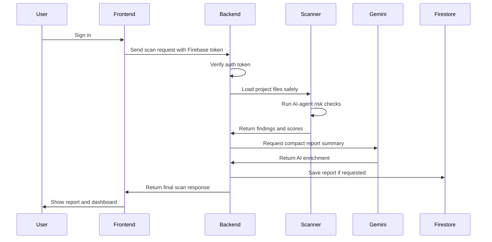

<div align="center">

# A-DAP-T

### AI-Agent Deployment Assessment and Protection Toolkit

**A pre-deployment risk scanner for GenAI and agentic application projects.**

A-DAP-T scans AI-agent repositories and uploaded projects for deployment risks such as exposed secrets, unsafe tool permissions, missing human approval gates, prompt-injection-prone workflows, weak auditability, and sensitive data exposure.

<br/>

[](https://a-dap-t.vercel.app/)
[](https://adapt-3s27.onrender.com/docs)
[](https://a-dap-t.vercel.app/)
[](#ai-layer)
[](#authentication-and-report-history)

<br/>

<a href="https://a-dap-t.vercel.app/"><b>Open Live App</b></a>
&nbsp;&nbsp;•&nbsp;&nbsp;
<a href="https://adapt-3s27.onrender.com/docs"><b>API Docs</b></a>

</div>

---

## Overview

Modern AI agents are no longer simple chat interfaces. They can call tools, read files, query databases, access customer records, send emails, trigger refunds, and perform workflow actions.

That creates a deployment problem: many teams can build an agent, but they do not always know whether the agent is safe enough to ship.

**A-DAP-T helps developers assess AI-agent deployment risk before release.** It combines rule-based static scanning, agent-specific risk checks, safety scoring, Gemini-powered report summarization, saved report history, and a report-aware assistant called **DAP**.

---

## What A-DAP-T Detects

A-DAP-T focuses on risks that matter specifically for AI-agent and GenAI applications:

| Risk Area | What A-DAP-T Looks For |
|---|---|
| Prompt Injection Risk | Prompt files, unsafe user input handling, exposed system instructions |
| Secret Exposure Risk | Hardcoded API keys, tokens, credentials, suspicious config values |
| Tool Permission Risk | Risky tools such as email, refund, file, database, URL, and shell actions |
| Human Approval Risk | Sensitive actions without approval gates or confirmation checks |
| Data Exposure Risk | Sensitive records, customer data, PII-like fields, unmasked tool outputs |
| Auditability Risk | Missing logging around critical agent/tool actions |

---

## Core Features

- **Authenticated scanning flow**
  - Users must sign in before running scans or viewing reports.

- **Public GitHub repository scanning**
  - Paste a public GitHub repository URL and scan it directly.

- **ZIP upload scanning**
  - Upload project ZIP files with safe file limits and no code execution.

- **Built-in demo scans**
  - Compare a vulnerable support agent against a secured support agent.

- **AI-agent-specific scanner rules**
  - Detects common LangChain, LangGraph, CrewAI, OpenAI-tool, Python, and JS/TS agent patterns.

- **Safety scoring**
  - Produces an overall score and category-level risk scores.

- **Report dashboard**
  - Shows category scores, findings, attack replay, permission graph, and remediation guidance.

- **Saved report history**
  - Authenticated users can revisit previously saved reports.

- **Gemini report enrichment**
  - Generates compact scan summaries, remediation plans, and next steps.

- **DAP assistant**
  - A report-aware assistant that answers questions using the current scan context.

- **Raw JSON export**
  - Download the current scan report as JSON.

- **PDF export**
  - Use browser print/save-as-PDF flow for report export.

---

## System Architecture

```mermaid
flowchart TD
    U[User] --> F[Vercel Frontend]

    F -->|Sign in / Sign up| AUTH[Firebase Auth]
    AUTH -->|ID Token| F

    F -->|Authenticated API Request| API[FastAPI Backend on Render]

    API -->|Verify Token| AUTH
    API --> SCAN[Scan Pipeline]

    SCAN --> GH[GitHub Repo ZIP Download]
    SCAN --> ZIP[Uploaded ZIP Scanner]
    SCAN --> DEMO[Demo Agent Scanner]

    GH --> SAFE[Safe Extraction + Text-Only File Loading]
    ZIP --> SAFE
    DEMO --> SAFE

    SAFE --> RULES[Rule-Based Risk Scanners]

    RULES --> R1[Secret Exposure Scanner]
    RULES --> R2[Tool Permission Scanner]
    RULES --> R3[Human Approval Scanner]
    RULES --> R4[Prompt Injection Scanner]
    RULES --> R5[Data Exposure Scanner]
    RULES --> R6[Auditability Scanner]
    RULES --> R7[Framework Pattern Scanner]

    R1 --> SCORE[Risk Scoring + Report Builder]
    R2 --> SCORE
    R3 --> SCORE
    R4 --> SCORE
    R5 --> SCORE
    R6 --> SCORE
    R7 --> SCORE

    SCORE --> GEMINI[Gemini AI Enrichment]
    GEMINI --> REPORT[Final Scan Report]

    REPORT --> FIRESTORE[Firestore Report History]
    REPORT --> F

    F --> DAP[DAP Assistant UI]
    DAP -->|Current Report Context| API
    API --> ASSISTANT[Report-Aware Assistant Service]
    ASSISTANT --> GEMINI
    ASSISTANT --> F
```



---

## Scan Workflow



---

## Tech Stack

| Layer | Technology |
|---|---|
| Frontend | HTML, CSS, JavaScript |
| Backend | Python, FastAPI, Pydantic, Uvicorn |
| Authentication | Firebase Auth |
| Database | Firebase Firestore |
| AI Layer | Gemini |
| Hosting | Vercel frontend, Render backend |
| Scanner Style | Rule-based static analysis + controlled simulation |
| Export | Raw JSON download, browser print/save-as-PDF |

---

## Backend API

> Authenticated scan endpoints require `Authorization: Bearer <firebase_id_token>`.

| Method | Endpoint | Purpose |
|---|---|---|
| `GET` | `/health` | Backend health check |
| `GET` | `/scan/demo/vulnerable` | Scan the vulnerable demo support agent |
| `GET` | `/scan/demo/secured` | Scan the secured demo support agent |
| `POST` | `/scan/upload` | Scan an uploaded ZIP project |
| `POST` | `/scan/github` | Scan a public GitHub repository |
| `GET` | `/reports` | List saved reports for the current user |
| `GET` | `/reports/{report_id}` | Fetch one saved report |
| `DELETE` | `/reports/{report_id}` | Delete one saved report |
| `POST` | `/assistant/chat` | Ask DAP about the current scan report |

---

## Expected Scan Response

A-DAP-T scan endpoints return a structured report object:

```json
{
  "project_name": "vulnerable-support-agent",
  "scan_type": "demo_vulnerable",
  "safety_score": 32,
  "status": "High Risk",
  "summary": {
    "critical": 1,
    "high": 5,
    "medium": 4,
    "low": 0
  },
  "category_scores": {
    "prompt_injection": 15,
    "secret_exposure": 65,
    "tool_permission": 45,
    "human_approval": 25,
    "data_exposure": 65,
    "auditability": 45
  },
  "findings": [],
  "graph": {},
  "attack_replay": [],
  "remediation_checklist": [],
  "ai_summary": "Compact scan summary.",
  "ai_report_summary": "Short report-safe summary.",
  "ai_remediation_plan": [],
  "ai_next_steps": [],
  "ai_enrichment_status": "gemini_success"
}
```

---

## GitHub Repository Scanning

A-DAP-T can scan a public GitHub repository by URL.

Example request:

```json
{
  "repo_url": "https://github.com/Dhruvg334/closira-smb-support-agent",
  "branch": "main",
  "save_report": true
}
```

The backend validates the GitHub URL, downloads the repository ZIP, applies safe extraction limits, scans supported files as text, and returns a normal A-DAP-T scan report.

A-DAP-T does **not** execute repository code.

---

## ZIP Upload Safety Limits

Uploaded projects are handled conservatively:

- Maximum ZIP size: **20 MB**
- Maximum files: **300**
- Maximum nesting depth: **6**
- Maximum single file size: **500 KB**
- Files are read as text only
- Uploaded code is never executed
- Temporary files are cleaned after scanning

---

## AI Layer

A-DAP-T uses Gemini only after rule-based scanning is complete.

Gemini helps generate:

- compact scan summary
- report-safe summary
- concise remediation plan
- concise next steps
- DAP assistant responses

Gemini does **not** decide:

- raw findings
- severity
- category scores
- safety score
- deployment status

The core detection remains rule-based and explainable.

---

## DAP Assistant

**DAP** is the report-aware assistant inside A-DAP-T.

It uses the current scan report as context and helps answer questions like:

- What should I fix first?
- Why is this finding high risk?
- Which category is most important?
- How can I improve the score?
- What does this tool permission issue mean?

DAP is intentionally scoped to report interpretation and remediation guidance. It is not a generic chatbot.

---

## Authentication and Report History

A-DAP-T uses Firebase Auth for account access.

Authenticated users can:

- run scans
- save reports
- view report history
- reopen previous reports
- ask DAP questions using report context

Firestore stores report history for each authenticated user.

---

## Local Setup

### 1. Clone the Repository

```bash
git clone <your-repository-url>
cd a-dap-t
```

### 2. Backend Setup

```bash
cd backend
python -m venv venv
venv\Scripts\activate
pip install -r requirements.txt
uvicorn main:app --reload
```

Backend runs at:

```text
http://127.0.0.1:8000
```

API docs:

```text
http://127.0.0.1:8000/docs
```

### 3. Frontend Setup

Open a second terminal:

```bash
cd frontend
python -m http.server 5173
```

Frontend runs at:

```text
http://localhost:5173/index.html
```

---

## Environment Variables

Create a local backend `.env` file for development.

```env
GEMINI_API_KEY=your_gemini_api_key_here
GEMINI_MODEL=gemini-2.5-flash

FIREBASE_PROJECT_ID=your_project_id
FIREBASE_CLIENT_EMAIL=your_service_account_email
FIREBASE_PRIVATE_KEY=your_private_key
```

Do not commit real secrets.

---

## Project Structure

```text
a-dap-t/
├── backend/
│   ├── main.py
│   ├── requirements.txt
│   ├── .env.example
│   ├── app/
│   │   ├── ai/
│   │   ├── auth/
│   │   ├── content/
│   │   ├── github/
│   │   ├── graph/
│   │   ├── risk/
│   │   ├── scanners/
│   │   ├── schemas/
│   │   ├── security_assistant/
│   │   ├── services/
│   │   └── utils/
│   └── tests/
│
├── frontend/
│   ├── index.html
│   ├── main.js
│   ├── shared.css
│   ├── signin.html
│   ├── signup.html
│   ├── profile.html
│   └── pages/
│       ├── scanner.html
│       ├── dashboard.html
│       ├── report.html
│       └── methodology.html
│
├── sample_agents/
│   ├── vulnerable-support-agent/
│   └── secured-support-agent/
│
└── docs/
    ├── DEMO_SCRIPT.md
    ├── LIMITATIONS.md
    ├── SCORING_METHODOLOGY.md
    └── THREAT_MODEL.md
```

---

## What Makes It Different

Most scanners look for generic code security issues. A-DAP-T focuses on **AI-agent deployment behavior**:

- Can the agent call a risky tool?
- Is a human approval gate missing?
- Are sensitive records passed into the agent?
- Are system prompts exposed?
- Are agent actions logged?
- Are tool permissions too broad?
- Can developers understand what must be fixed before deployment?

That makes A-DAP-T more focused than a normal repository scanner and more practical than a generic chatbot demo.

---

## Limitations

A-DAP-T is an early risk visibility tool.

It does not:

- execute uploaded projects
- replace a professional security audit
- detect every possible vulnerability
- fully validate runtime behavior
- guarantee that an AI agent is safe for production

It is designed to help developers catch common deployment risks earlier.

---

## Team

Built by:

- **Dhruv Gupta**
- **Pavit Agrawal**
- **Akshhaya Isa**

---

<div align="center">

**A-DAP-T helps teams move from prototype to deployment with clearer AI-agent risk visibility.**

</div>
