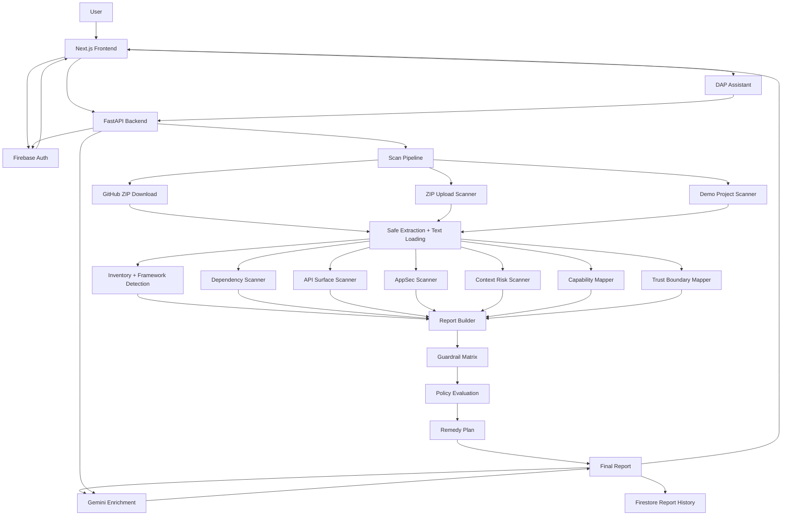

<div align="center">

# A-DAP-T

### AI-Agent Deployment Assessment and Protection Toolkit

**A-DAP-T is an AI application security review platform for evaluating agentic and GenAI applications before deployment.**

It scans repositories and uploaded projects as text, maps security-relevant surfaces, evaluates guardrail coverage, applies release policy checks, and produces an evidence-backed report with a deployment decision and fix-first remediation plan.

<br />

[](https://a-dap-t.vercel.app/)
[](https://adapt-3s27.onrender.com/docs)
[](https://a-dap-t.vercel.app/)
[](#ai-layer)
[](#authentication-and-report-history)

<br />

<a href="https://a-dap-t.vercel.app/"><b>Open Live App</b></a>
&nbsp;&nbsp;•&nbsp;&nbsp;
<a href="https://adapt-3s27.onrender.com/docs"><b>API Docs</b></a>
&nbsp;&nbsp;•&nbsp;&nbsp;
<a href="https://www.youtube.com/watch?v=1r-QIjQmbbo"><b>Demo Video</b></a>

</div>

---

## Overview

Modern AI applications do more than generate text. They expose APIs, call tools, read files, interact with customer data, use memory/context, trigger workflow actions, and depend on approval and audit paths that must hold up before release.

A-DAP-T reviews that deployment surface.

It combines deterministic static analysis, AI-agent-specific security checks, application surface mapping, guardrail evaluation, release policy scoring, static proof paths, patch previews, report comparison, saved report history, and a report-aware assistant called **DAP**.

A-DAP-T does not execute uploaded projects. It reads supported files as text and produces structured security review artifacts from visible project evidence.

---

## Product Workflow

A-DAP-T follows a release-review workflow:

```text
Scan → Map → Guardrail → Prove → Patch → Compare → Gate
```

| Stage | Purpose |
|---|---|
| Scan | Load supported project files safely and identify security-relevant signals |
| Map | Build inventory, framework, dependency, API, capability, and trust-boundary artifacts |
| Guardrail | Evaluate visible controls such as auth, rate limits, approvals, audit logs, allowlists, and masking |
| Prove | Generate static proof paths linked to detected risks without running live exploits |
| Patch | Produce developer-readable patch previews and remediation guidance |
| Compare | Compare saved reports to show score movement, fixed risks, and new findings |
| Gate | Produce a BLOCK / REVIEW / ALLOW release decision with policy evidence |

---

## Core Capabilities

### Project Ingestion

- Public GitHub repository scanning
- ZIP upload scanning with safe extraction limits
- Built-in vulnerable and secured demo scans
- Text-only file loading
- No project code execution

### Security Surface Mapping

A-DAP-T builds structured report artifacts across the project:

- project metadata
- file inventory
- framework detection
- dependency risks
- API surface
- AppSec risks
- context and memory risks
- capability map
- trust boundaries
- guardrail matrix
- policy evaluation
- remedy plan

### AI-Agent Risk Review

A-DAP-T checks agentic application risks that generic scanners often miss:

- unsafe tool access
- broad tool permissions
- missing human approval gates
- missing audit trails
- sensitive actions without confirmation
- exposed system prompts
- prompt-injection-prone workflows
- memory/context poisoning risk
- untrusted retrieved context influencing tool behavior
- sensitive data exposure through tool output or project files

### Application Security Review

A-DAP-T also reviews common AppSec risks found in AI application projects:

- path traversal patterns
- SSRF-like request flows
- command execution sinks
- SQL injection patterns
- unsafe archive extraction
- unsafe deserialization patterns
- raw HTML/XSS-prone output patterns
- weak JWT/auth configuration signals
- unsafe upload handling

### Dependency Review

A-DAP-T reviews supported package manifests and lockfiles for dependency hygiene issues:

- missing lockfiles
- unpinned Python dependencies
- direct git dependencies
- editable installs
- suspicious package names
- package metadata drift signals

### API Surface Review

A-DAP-T maps visible API routes and checks for release-relevant control signals:

- visible authentication
- rate limiting
- CORS posture
- upload-like endpoints
- costly AI/LLM endpoints
- externally reachable routes
- risky operation naming patterns

### Guardrail Matrix

The guardrail matrix evaluates whether the application shows visible controls for:

- authentication
- authorization
- rate limiting
- CORS policy
- file upload safety
- input validation
- output encoding
- prompt injection defense
- tool allowlists
- human approval
- audit logging
- secrets management
- dependency security
- memory/context isolation
- PII masking
- command execution sandboxing

### Release Policy Evaluation

A-DAP-T converts scan artifacts into a release decision:

- **BLOCK** — high-risk release blockers are present
- **REVIEW** — release may proceed only after manual review or remaining fixes
- **ALLOW** — no blocking signals detected under the selected policy

The decision is based on score, required controls, hard blockers, and visible evidence from the report.

### Remedy Plan

A-DAP-T turns findings into a prioritized fix sequence:

- what to fix first
- why it matters
- expected gate impact
- validation steps
- linked evidence
- patch previews where available

### DAP Report Assistant

DAP is a report-aware assistant scoped to the current scan report.

It helps answer questions such as:

- What should I fix first?
- Why is this release blocked?
- Which guardrails are weakest?
- Which findings affect the deployment gate?
- How should I explain this report to a developer?
- What changed between two reports?

DAP uses the current report context and does not replace the deterministic scanner or release policy logic.

---

## What Makes A-DAP-T Different

Most security scanners focus on isolated files, package vulnerabilities, or generic code patterns.

A-DAP-T reviews the **AI application release surface**:

| Area | Why It Matters |
|---|---|
| Agent capabilities | A model-backed app can take actions, not just return text |
| Tool permissions | Unsafe tools can create real workflow impact if not scoped |
| Human approval | Sensitive actions need approval paths before execution |
| Memory and context | Retrieved or persistent context can influence future behavior |
| API controls | AI-heavy endpoints need auth, rate limits, and upload safeguards |
| Guardrail coverage | Findings matter more when mapped to missing controls |
| Policy gates | Teams need a release decision, not only a list of warnings |
| Remedy planning | Developers need a fix sequence, not just risk labels |

A-DAP-T connects these signals into one deployment-readiness report.

---

## System Architecture



---

## Tech Stack

| Layer | Technology |
|---|---|
| Frontend | Next.js App Router, React, TypeScript, custom CSS |
| Backend | Python, FastAPI, Pydantic, Uvicorn |
| Authentication | Firebase Auth |
| Database | Firebase Firestore |
| AI Layer | Gemini, default model `gemini-2.5-flash` |
| Hosting | Vercel frontend, Render backend |
| Scanner Style | Rule-based static analysis with structured report artifacts |
| Export | Raw JSON, browser PDF, patch previews, policy JSON, GitHub Actions YAML |

---

## Backend API

Protected endpoints require:

```text
Authorization: Bearer <firebase_id_token>
```

| Method | Endpoint | Purpose |
|---|---|---|
| `GET` | `/health` | Backend health check |
| `POST` | `/auth/refresh` | Refresh Firebase ID tokens for active sessions |
| `GET` | `/scan/demo/vulnerable` | Scan the vulnerable demo support agent |
| `GET` | `/scan/demo/secured` | Scan the secured demo support agent |
| `POST` | `/scan/upload` | Scan an uploaded ZIP project |
| `POST` | `/scan/github` | Scan a public GitHub repository |
| `GET` | `/reports` | List saved reports for the current user |
| `GET` | `/reports/{report_id}` | Fetch one saved report |
| `DELETE` | `/reports/{report_id}` | Delete one saved report |
| `POST` | `/assistant/chat` | Ask DAP about the current scan report |
| `POST` | `/deployment-gate/evaluate` | Re-evaluate a report against deployment-gate policy |

---

## Report Object

A-DAP-T scan endpoints return a structured report object. Key fields include:

| Field | Purpose |
|---|---|
| `project_name` | Scanned project name |
| `scan_type` | Demo, GitHub, or upload scan source |
| `safety_score` | Legacy compatibility score |
| `v3_security_score` | Current security review score |
| `status` | Overall risk status |
| `v3_status` | Current status label |
| `findings` | Scanner findings |
| `project_metadata` | Project and scan metadata |
| `file_inventory` | File inventory summary |
| `framework_detection` | Framework and stack signals |
| `dependency_risks` | Dependency hygiene findings |
| `api_surface` | API route and control signals |
| `appsec_risks` | Static AppSec risk findings |
| `context_poisoning_risks` | Memory/context risk findings |
| `capability_map` | Agent/tool/application capabilities |
| `trust_boundaries` | Cross-boundary data/action flows |
| `guardrail_matrix` | Visible control coverage |
| `policy_evaluation` | Release policy result |
| `remedy_plan` | Prioritized remediation actions |
| `attack_simulations` | Static proof paths |
| `patches` | Patch previews |
| `deployment_gate` | BLOCK / REVIEW / ALLOW gate output |
| `ai_summary` | Compact AI-generated summary |
| `report_id` | Saved report identifier when stored |

---

## Demo Projects

A-DAP-T includes two built-in demo projects.

### Vulnerable Support Agent

A deliberately unsafe support-agent project containing realistic release blockers:

- missing approval gates
- missing audit logs
- weak API controls
- wildcard CORS
- unsafe tool actions
- memory/context isolation gaps
- SSRF, path traversal, shell execution, and unsafe extraction patterns
- dependency hygiene issues

Expected outcome:

```text
Low security score
Critical / high-risk status
Policy decision: BLOCK
```

### Secured Support Agent

A hardened support-agent project with stronger visible controls:

- authentication hooks
- rate-limit signals
- restricted CORS
- approval identifiers
- reviewer checks
- audit logs
- source metadata for memory
- safer upload/path handling
- dependency lockfile

Expected outcome:

```text
Higher security score
Lower-risk status
Policy decision: REVIEW or ALLOW depending on policy artifacts
```

---

## GitHub Repository Scanning

A-DAP-T can scan a public GitHub repository by URL.

Example request:

```json
{
  "repo_url": "https://github.com/example-org/example-agent-app",
  "branch": "main",
  "save_report": true
}
```

The backend validates the URL, downloads the repository ZIP, applies safe extraction limits, scans supported files as text, and returns a normal A-DAP-T report.

---

## ZIP Upload Safety Limits

Uploaded projects are handled conservatively:

- Maximum ZIP size: **20 MB**
- Maximum files: **300**
- Maximum nesting depth: **6**
- Maximum single file size: **500 KB**
- Files are read as text only
- Uploaded code is not executed
- Temporary files are cleaned after scanning

---

## AI Layer

A-DAP-T uses Gemini after deterministic scanning and report artifact generation.

Gemini helps generate:

- compact scan summaries
- report-safe summaries
- remediation explanation
- next-step guidance
- DAP assistant responses

Gemini does not decide:

- raw scanner findings
- severity values
- static proof paths
- patch preview logic
- guardrail coverage
- release policy decisions

The core report remains artifact-driven and explainable.

---

## Authentication and Report History

A-DAP-T uses Firebase Auth for account access.

Authenticated users can:

- run scans
- save reports
- view report history
- reopen previous reports
- delete saved reports
- compare saved reports
- ask DAP questions using report context

Firestore stores report history for each authenticated user.

---

## Local Setup

### 1. Clone the Repository

```bash
git clone <repository-url>
cd a-dap-t
```

### 2. Backend Setup

```bash
cd backend
python -m venv venv
venv\Scripts\activate
pip install -r requirements.txt
uvicorn main:app --reload
```

Backend runs at:

```text
http://127.0.0.1:8000
```

API docs:

```text
http://127.0.0.1:8000/docs
```

### 3. Frontend Setup

Open a second terminal:

```bash
cd frontend
npm install
npm run dev
```

Frontend runs at:

```text
http://localhost:3000
```

### 4. Frontend Build Check

```bash
cd frontend
npx tsc --noEmit
npm run build
```

### 5. Backend Test Check

```bash
cd backend
venv\Scripts\activate
python -m pytest -q
```

---

## Environment Variables

Create a backend `.env` file for local development:

```env
GEMINI_API_KEY=your_gemini_api_key_here
GEMINI_MODEL=gemini-2.5-flash

FIREBASE_PROJECT_ID=your_project_id
FIREBASE_CLIENT_EMAIL=your_service_account_email
FIREBASE_PRIVATE_KEY=your_private_key
```

The frontend reads the backend URL from:

```env
NEXT_PUBLIC_ADAPT_API_BASE=https://adapt-3s27.onrender.com
```

Do not commit real secrets.

---

## Project Structure

```text
a-dap-t/
├── backend/
│   ├── main.py
│   ├── requirements.txt
│   ├── app/
│   │   ├── ai/
│   │   ├── api_security/
│   │   ├── appsec/
│   │   ├── attack_simulator/
│   │   ├── capabilities/
│   │   ├── context_security/
│   │   ├── dependencies/
│   │   ├── deployment_gate/
│   │   ├── github/
│   │   ├── guardrails/
│   │   ├── inventory/
│   │   ├── patches/
│   │   ├── policies/
│   │   ├── remedy/
│   │   ├── risk/
│   │   ├── scanners/
│   │   ├── schemas/
│   │   ├── security_assistant/
│   │   ├── services/
│   │   └── utils/
│   ├── scripts/
│   └── tests/
│
├── frontend/
│   ├── app/
│   │   ├── about/
│   │   ├── compare/
│   │   ├── methodology/
│   │   ├── profile/
│   │   ├── report/current/
│   │   ├── scanner/
│   │   ├── signin/
│   │   └── signup/
│   ├── components/
│   ├── lib/
│   ├── public/
│   └── types/
│
├── sample_agents/
│   ├── vulnerable-support-agent/
│   └── secured-support-agent/
│
└── docs/
```

---

## Contribution Policy

Contributions are welcome through issues and pull requests.

Good contribution areas include:

- scanner rule improvements
- report artifact improvements
- frontend UI fixes
- documentation corrections
- test coverage
- policy-pack improvements
- sample project improvements
- false-positive reduction

Before opening a large pull request, create an issue describing the proposed change and the reason for it.

By submitting a contribution, you agree that your contribution may be included in this repository under the project license.

---

## License

A-DAP-T is distributed under the **A-DAP-T Source-Available Attribution License**.

You may read the source, fork the repository, submit issues, and contribute through pull requests.

You may not copy, redistribute, rebrand, or present this project as your own without attribution to the original repository and author.

See [LICENSE](./LICENSE) for full terms.

---

<div align="center">

**A-DAP-T helps review AI application deployment risk before release.**

</div>
