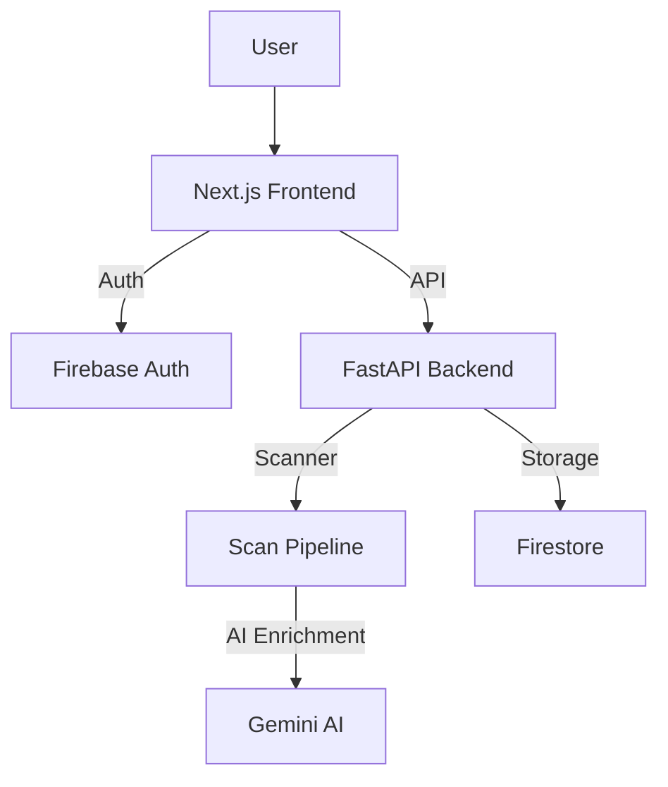

<div align="center">

# A-DAP-T

### AI-Agent Deployment Assessment and Protection Toolkit

**A pre-deployment risk scanner for GenAI and agentic application projects.**

A-DAP-T scans AI-agent repositories and uploaded projects for deployment risks such as exposed secrets, unsafe tool permissions, missing human approval gates, prompt-injection-prone workflows, weak auditability, and sensitive data exposure.

<br/>

[](https://a-dap-t.vercel.app/)
[](https://adapt-3s27.onrender.com/docs)
[](https://a-dap-t.vercel.app/)
[](#ai-layer)

<br/>

<a href="https://a-dap-t.vercel.app/"><b>Open Live App</b></a>
&nbsp;&nbsp;•&nbsp;&nbsp;
<a href="https://adapt-3s27.onrender.com/docs"><b>API Docs</b></a>

</div>

---

## Overview

Modern AI agents can call tools, query databases, and perform workflow actions. This creates a deployment problem: knowing whether the agent is safe enough to ship.

**A-DAP-T helps developers assess AI-agent deployment risk before release.** It combines rule-based static scanning, safety scoring, Gemini-powered report enrichment, and a project-wide safety dashboard.

---

## What A-DAP-T Detects

| Risk Area | What A-DAP-T Looks For |
|---|---|
| Prompt Injection Risk | Prompt files, unsafe user input handling, exposed system instructions |
| Secret Exposure Risk | Hardcoded API keys, tokens, credentials |
| Tool Permission Risk | Risky tools such as email, refund, file, and database actions |
| Human Approval Risk | Sensitive actions without approval gates |
| Data Exposure Risk | Sensitive records, customer data, PII-like fields |
| Auditability Risk | Missing logging around critical agent/tool actions |

---

## Core Features

- **Project Safety Trends**: A dashboard in the user profile that visualizes safety score improvements over time using Chart.js, with project-based grouping.
- **Report Comparison System**: Select any two reports from your history to calculate score deltas, fixed findings, and category-specific improvements.
- **Authenticated scanning flow**: Full Firebase Auth integration for saving and managing scan history.
- **GitHub & ZIP Scanning**: Scan public repositories or local project uploads.
- **DAP Assistant**: A report-aware AI assistant that answers questions using your specific scan context.
- **Remediation Patching**: Suggested code fixes and patches for identified risks.

---

## System Architecture



---

## Tech Stack

| Layer | Technology |
|---|---|
| Frontend | Next.js 14 (App Router), React, TypeScript, Tailwind CSS |
| Backend | Python, FastAPI, Pydantic |
| Authentication | Firebase Auth |
| Database | Firebase Firestore |
| AI Layer | Gemini 1.5 Flash |
| Charts | Chart.js & react-chartjs-2 |

---

## Local Setup

### 1. Clone the Repository
```bash
git clone <your-repository-url>
cd a-dap-t
```

### 2. Backend Setup
```bash
cd backend
python -m venv venv
source venv/bin/activate # Windows: venv\Scripts\activate
pip install -r requirements.txt
uvicorn main:app --reload
```
*Backend runs at `http://localhost:8000`*

### 3. Frontend Setup
```bash
cd frontend
npm install
npm run dev
```
*Frontend runs at `http://localhost:3000`*

---

## Project Structure

```text
a-dap-t/
├── backend/            # FastAPI Source
├── frontend/           # Next.js Application
│   ├── app/           # App Router Pages (profile, compare, scanner)
│   ├── components/    # React Components (TrendsChart, Navbar, etc.)
│   ├── lib/           # API and Auth Utilities
│   └── public/        # Assets
├── sample_agents/      # Demo Scan Projects
└── docs/               # Methodology and Threat Models
```

---

## Team
Built by: **Dhruv Gupta**, **Pavit Agrawal**, **Akshhaya Isa**
